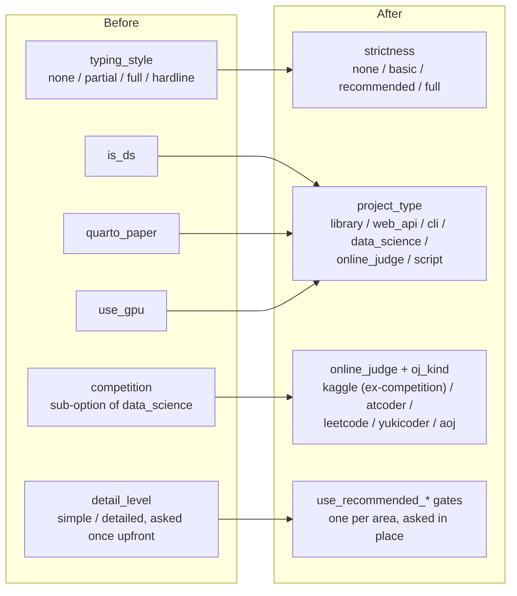

[](https://github.com/kasi-x/python-copier-template/actions/workflows/ci.yml)
[](https://www.apache.org/licenses/LICENSE-2.0)
[](https://scorecard.dev/viewer/?uri=github.com/kasi-x/python-copier-template)
[](https://github.com/astral-sh/ruff)
[](https://github.com/pre-commit/pre-commit)

# python-copier-template

An opinionated [copier](https://copier.readthedocs.io) template for Python
projects. It can be optionally used to:

- Create new projects from
- Update existing projects in line with it
- Keep projects in sync with changes to it
- Provide a source of inspiration to cherry-pick from

Source          | <https://github.com/kasi-x/python-copier-template>
:---:           | :---:
Documentation   | <https://kasi-x.github.io/python-copier-template>
Releases        | <https://github.com/kasi-x/python-copier-template/releases>

## Features

The template asks a few questions and generates a project tailored to your answers.

**Recommended settings, per area** (`use_recommended_agent`,
`use_recommended_toolchain`, `use_recommended_data_science`,
`use_recommended_polish`, `use_recommended_docs`, `use_recommended_quality`,
`use_recommended_license`, `use_recommended_integrations`,
`use_recommended_web_api`, `use_recommended_security`)
- Besides the essentials (project type, package name, author, ...), each
  customisable area of the template — AI-agent scaffolding, toolchain,
  data-science options (GPU, DUO/CARE data governance), online-judge kind,
  web-API stack, layout & style, docs, type-checking & strictness, license &
  FAIR metadata, deployment & integrations (including the logging library),
  security & compliance (SHA-pinned CI, SECURITY.md, zizmor) — asks a single
  "use the recommended settings?" question first (default: yes), with the
  recommendation spelled out in its help text.
- Answer **yes** and the area is configured from its defaults without
  asking anything else; answer **no** and the detailed question(s) for that
  area are asked (package manager choice, CI provider, GPU, cloud provider,
  and so on).

The branches below follow the order the questions are actually asked in
(`copier.yml`); each gate's Yes/No branches rejoin before the next gate:

```mermaid
flowchart TD
    Start([Start]) --> PT[project_type]
    PT -->|ros2| RQ["ask: pkg_language, ros_distro,<br/>ros2_package_manager"]
    PT -->|micropython| MQ["ask: micropython_port"]
    PT -->|library / cli| G0{use_recommended_agent?}
    RQ --> G1{use_recommended_toolchain?}
    MQ --> G1
    PT -->|other| G1

    G0 -->|Yes| D0["no agent scaffold"]
    G0 -->|No| A0["ask: agent (pydantic-ai) scaffold"]
    D0 --> G1
    A0 --> G1

    G1 -->|Yes| D1["uv + just<br/>(pixi if ros2+pixi)"]
    G1 -->|No| A1["ask: package_manager, task_runner"]
    D1 --> OJ{project_type == online_judge?}
    A1 --> OJ

    OJ -->|Yes| OQ["ask: oj_kind (kaggle / atcoder / leetcode / yukicoder / aoj)"]
    OJ -->|No| DS{project_type == data_science?}
    OQ --> DS

    DS -->|Yes| G2{use_recommended_data_science?}
    DS -->|No| M1((•))
    G2 -->|Yes| D2["GPU: yes · no DUO/CARE"]
    G2 -->|No| A2["ask: use_gpu, data_reusable → DUO sheet<br/>ask: data_ethics → CARE statement"]
    D2 --> M1
    A2 --> M1
    M1 --> G3{use_recommended_polish?}

    G3 -->|Yes| D3["src layout · English docstrings"]
    G3 -->|No| A3["ask: layout, allow_japanese"]
    D3 --> G4{use_recommended_docs?}
    A3 --> G4

    G4 -->|Yes| D4["zensical"]
    G4 -->|No| A4["ask: docs_type"]
    D4 --> G5{use_recommended_quality?}
    A4 --> G5

    G5 -->|Yes| D5["basedpyright + pyrefly · strictness: recommended"]
    G5 -->|No| A5["ask: type_checker, strictness"]
    D5 --> G6{use_recommended_license?}
    A5 --> G6

    G6 -->|Yes| D6["MIT · no FAIR metadata"]
    G6 -->|No| A6["ask: license, fair, author_orcid"]
    D6 --> G7{use_recommended_integrations?}
    A6 --> G7

    G7 -->|Yes| D7["no Docker/PyPI/cloud/Sentry/MCP · CI: GitHub Actions · structlog"]
    G7 -->|No| A7["ask: docker, pypi, cloud_provider, include_sentry,<br/>include_mcp, ci_provider, log_library"]
    D7 --> WA{project_type == web_api?}
    A7 --> WA

    WA -->|Yes| G8{use_recommended_web_api?}
    WA -->|No| G9{use_recommended_security?}
    G8 -->|Yes| D8["FastAPI + async SQLAlchemy + Alembic + Postgres<br/>demo CRUD · request-id · /health + /docs"]
    G8 -->|No| A8["ask: prometheus, rate_limit, cors"]
    D8 --> G9
    A8 --> G9

    G9 -->|Yes| D9["SHA-pinned actions · zizmor · SECURITY.md · test_qa.py"]
    G9 -->|No| A9["ask: security_policy, scorecard"]
    D9 --> PD["Project details: package_name · description · git platform · author"]
    A9 --> PD
    PD --> End([Generate project])
```



**Package management** (`package_manager`)
- **uv** — fast, pure Python package manager (default)
- **pixi** — conda-based package manager with cross-language support
- **poetry** — dependency management and packaging with Poetry

**Task runner** (`task_runner`, and `task_runner_pixi` when package_manager is pixi)
- **just** — [Just](https://just.systems) justfile (default with uv/poetry)
- **task** — [Task](https://taskfile.dev) Taskfile
- **poe** — [poethepoet](https://github.com/nat-n/poethepoet) tasks in `pyproject.toml`
- **make** — GNU Make
- **pixi** — pixi's native tasks (default with pixi; poethepoet is not offered there)
- One shared task definition (`_tasks.jinja`) drives local dev *and* CI:
  the generated CI invokes the same tasks via a `_tasks.yml` reusable workflow

**Project type** (`project_type`)
- **library** — a Python library/package
- **web_api** — a working FastAPI scaffold (async SQLAlchemy 2.0 + Alembic +
  Postgres, demo CRUD router, request-id logging, `/health` + `/docs`).
  Ships `compose.local.yml` (API + Postgres) and a CI test job backed by a
  Postgres service container. Optional: Prometheus `/metrics`, slowapi rate
  limiting, CORS (see the [web-api how-to](https://kasi-x.github.io/python-copier-template/main/how-to/web-api.html))
- **cli** — a command-line tool
- **data_science**: `data/`, `models/`, `reports/`, `notebooks/` and a `src/`
  pipeline (`src/data`, `src/features`, ...) layout. GPU Dockerfile and a
  Quarto paper are always included. Ships polars / duckdb / pyarrow as base
  deps and a `data/queries/` SQL workspace readable via
  `duckdb.sql(open("data/queries/example.sql").read())`.
- **online_judge**: a competitive-programming / Kaggle project. The follow-up
  `oj_kind` question picks the judge:
  - **kaggle**: the competition layout `src/{configs,data,input,output,features,logs,models,notebook,scripts,utils}` where `src/utils` is the installable package, plus the GPU Dockerfile
  - **atcoder / leetcode / yukicoder / aoj**: a bare code-submission workspace
    (stdlib only) — no package or `solutions/` tree is generated, and the
    repo stays empty until a CLI tool creates the per-problem folders and
    `test/` sample files (`oj` for AtCoder / yukicoder, `acc` for AtCoder
    contests, `aoj-cli` for AOJ; LeetCode is solved in its own editor)
- **script** — a minimal script, flat package at the repo root
- **web_django** — *not supported*: selecting it aborts generation with a
  pointer to FastAPI / Litestar / Flask and the upstream
  [cookiecutter-django](https://github.com/cookiecutter/cookiecutter-django)
  (see the [web-api how-to](https://kasi-x.github.io/python-copier-template/main/how-to/web-api.html))
- **ros2** — a ROS 2 package (`ament_python` with rclpy, or `ament_cmake`
  with C++), built with **colcon + rosdep**. Choose **Humble** (Ubuntu
  22.04 / Python 3.10, recommended for its wide deployment) or **Jazzy**
  (Ubuntu 24.04 / Python 3.12), and provision the environment with **apt**
  (classic `ros-<distro>-*` + industrial_ci) or **pixi** (RoboStack
  conda-forge via `https://prefix.dev/robostack-<distro>`). Generates
  `package.xml`, `setup.py`/`CMakeLists.txt`, `resource/`, ament linter
  tests, `Dockerfile.ros2`, and a ROS-aware devcontainer. CI runs
  industrial_ci (apt) or setup-pixi + colcon (pixi). See the
  [ros2 how-to](https://kasi-x.github.io/python-copier-template/main/how-to/ros2.html)
- **micropython** — MicroPython firmware for a microcontroller (ESP32 / RP2 /
  STM32 / ...). Choose the target **port** (`micropython_port`); the firmware
  lives in `firmware/` (`boot.py`, `main.py`, `board_config.py` + a
  device-independent `core/`), is deployed with **mpremote**, and is
  type-checked against `micropython-<port>-stubs` (installed into a git-ignored
  `typings/` folder). The CPython dev toolchain (uv/ruff/pytest/basedpyright)
  coexists to unit-test `core/`. See the
  [MicroPython how-to](https://kasi-x.github.io/python-copier-template/main/how-to/micropython.html)

**Layout** (`layout`, for `library` / `web_api` / `cli`)
- **src** — package in a `src/` directory (**default**; prevents accidental
  imports of an uninstalled package)
- **flat** — package at the repository root
- `data_science` always uses `src/`; `online_judge` with the `kaggle` kind
  uses `src/` too (as `src/utils`); `script` always uses flat; `micropython`
  and `ros2` don't ask (firmware/ament layouts instead)

**AI agent** (`use_recommended_agent`, for `library` / `cli`)
- Recommended: **no** — a plain library / CLI without agent tooling.
- Answer **no** to scaffold a runnable [pydantic-ai](https://ai.pydantic.dev)
  example: a `prompts/agent.md` system prompt, a typed `tools/` package
  (`tools/example.py`) and a module-level `agent` wired with `@agent.tool`.
  `python -m <package>.agent "..."` runs offline via pydantic-ai's
  `TestModel`; pass `--model openai:gpt-4o-mini` (with the matching API key in
  the environment) for a real model.

**Cloud / integrations**
- **Cloud provider** (`cloud_provider`): `none` (default) / `aws` (boto3 +
  service type stubs) / `gcp` (google-cloud-storage) / `azure`
  (azure-identity). For `aws`, `aws_services` picks the `boto3-stubs` extra
  (`essential` / `s3` / `dynamodb` / `sqs` / `lambda`).
- **Sentry** (`include_sentry`): adds `sentry-sdk` and initialises it from
  `SENTRY_DSN` at CLI startup.
- **MCP** (`include_mcp`, cli / web_api): adds the `mcp[cli]` SDK and
  scaffolds an `mcp_server.py` with typed example tools, a `ToolError`
  sample and a resource, plus a `mcp-server-<name>` console script and an
  in-process client test — the template's first *long-running executable*
  layer (see
  [the layer model](https://kasi-x.github.io/python-copier-template/main/explanations/long-running.html)
  and the
  [MCP how-to](https://kasi-x.github.io/python-copier-template/main/how-to/mcp.html)).
  Run it with stdio (an MCP host launches `uv run mcp-server-<name>`) or
  streamable-http (`--transport streamable-http`), and debug it with the
  MCP Inspector (`uv run mcp dev src/<package>/mcp_server.py`).
- **Logging library** (`log_library`): `structlog` (default) / `loguru` /
  `picologging` / `logging` (standard library, no extra dependency).
  `logging_setup.py` exposes the same `logger.bind(...)` / `logger.info(event,
  **fields)` call shape regardless of which one is chosen, plus a
  `LOG_FORMAT=json` console/JSON switch. Not asked for `ros2` packages (they
  use rclpy's own node logger) or `micropython` firmware (logging runs on the
  device, not through CPython's logging stack).

**Experimentation** (`[project.optional-dependencies] experiment` / pixi `experiment` feature)
- marimo notebooks, matplotlib / seaborn / plotly for debugging, plus LLM API deps
- Kept separate from the minimal runtime dependencies

**License & changelog**
- **License** (`license`, asked when you opt out of `use_recommended_license`
  — the recommendation is MIT): the full
  [choosealicense.com](https://choosealicense.com) list (MIT, Apache-2.0,
  GPL/LGPL/AGPL, BSD variants, MPL-2.0, ISC, Unlicense, CC0, and more), plus a
  `Proprietary` / all-rights-reserved option. Sets the `LICENSE` file text,
  `pyproject.toml`'s PEP 639 `license`/`license-files`, and the README badge.
  Regenerated from source via `tools/generate_license_template.py`.
- **Changelog**: [git-cliff](https://git-cliff.org) generates `CHANGELOG.md`
  from [Conventional Commits](https://www.conventionalcommits.org); commit
  messages are enforced by a `conventional-pre-commit` hook, and each
  GitHub Release's notes are generated by git-cliff from that tag's commits.
- **FAIR / research-software metadata** (adapted from
  [fair-python-cookiecutter](https://github.com/Materials-Data-Science-and-Informatics/fair-python-cookiecutter)):
  the `fair` option adds a `CITATION.cff` (validated by a pre-commit hook,
  optional `author_orcid`); the `reuse` hook additionally covers `REUSE.toml`
  with SPDX annotations — only for open-source licenses, Proprietary
  projects skip it. It also adds a `fair-software.yml` GitHub Actions
  workflow running
  [howfairis](https://github.com/fair-software/howfairis-github-action) to
  measure compliance with the [fair-software.eu](https://fair-software.eu)
  recommendations on push to `main`.
- **Data governance** (`data_science` projects; independent
  of `fair`): a one-page de-identification protocol (ISO/IEC 20889), a
  data-transfer-agreement template and a transfer log always ship in
  `data/`, so every non-public extract that leaves for another organisation
  can be traced back to an agreement and an approver. On top of that,
  `data_reusable` opts into a **DUO** (Data Use Ontology) data-use
  conditions sheet, and `data_ethics` opts into a **CARE** principles
  data-governance statement (with provenance & custody records) — both
  asked under the data-science gate.

**Tooling**
- [setuptools](https://setuptools.pypa.io) + [setuptools-scm](https://setuptools-scm.readthedocs.io) packaging
- [pytest](https://docs.pytest.org), coverage, hypothesis
- [ruff](https://docs.astral.sh/ruff), [vulture](https://github.com/jendrikseipp/vulture),
  [deptry](https://deptry.com), [typos](https://github.com/crate-ci/typos)
- [basedpyright](https://docs.basedpyright.com) plus [pyrefly](https://github.com/facebook/pyrefly) or [ty](https://docs.astral.sh/ty/) as the secondary checker
- [pre-commit](https://pre-commit.com) with actionlint + zizmor for CI linting
- [OpenSSF Scorecard](https://securityscorecards.dev) workflow + a
  [SECURITY.md](SECURITY.md) vulnerability-reporting policy
- [editorconfig](https://editorconfig.org) (`.editorconfig`) for consistent
  editor indentation and line endings
- A `.env.example` with the environment variables the project understands
  (`.env` is git-ignored and auto-loaded by direnv / the compose stack)
- Author/GitHub-org questions default from local `git config`/`gh` (via a
  `copier-template-extensions`-loaded `extensions.py`); override at any prompt
- A task runner of your choice ([Task](https://taskfile.dev) (default) /
  [just](https://just.systems) / [poethepoet](https://github.com/nat-n/poethepoet) /
  [Make](https://www.gnu.org/software/make/), or pixi's native tasks) driving
  lint / type-check / test / docs — one shared task definition, invoked by CI too
- [zensical](https://zens.python.dev), [sphinx](https://www.sphinx-doc.org) or
  [great-docs](https://posit-dev.github.io/great-docs/) for docs
- README badge row: CI, coverage, license, a Python-version badge matching
  the actual CI test matrix, and each tool's own *officially documented*
  badge — [Ruff](https://github.com/astral-sh/ruff),
  [pre-commit](https://pre-commit.com) and a
  ["Made with Copier"](https://github.com/copier-org/copier#show-your-support)
  badge (h/t [reproML](https://github.com/Excidion/reproML) and
  [pypackage-template](https://github.com/browniebroke/pypackage-template)).
  No unofficial/inferred tool badges (e.g. uv, pixi have none) —
  [pawamoy/copier-uv](https://github.com/pawamoy/copier-uv), a well-known
  uv-based copier template, only badges CI/docs/chat for the same reason.

**CI/CD**
- **CI provider** (`ci_provider`): `github_actions` (default) generates the
  full GitHub Actions workflow set; `none` skips `.github/workflows/`
- GitHub Actions: `concurrency` with `cancel-in-progress`, minimal
  `permissions`, and a `required-checks-passed` gate for branch protection
- **Security gate** (`use_recommended_security`, default yes): GitHub Actions
  pinned to commit SHAs via renovate (`helpers:pinGitHubActionDigests`), a
  zizmor CI job auditing the workflows, a generated `tests/test_qa.py`, and —
  when you opt out (GitHub projects) — the choice of a `SECURITY.md`
  vulnerability policy and an OpenSSF Scorecard workflow (public repos only).
  GitLab projects keep the hardened `.gitlab-ci.yml` but skip the GitHub-only
  files (SECURITY.md / Scorecard)
- PyPI publishing, Docker containers, docs deployment to GitHub Pages

## Design decisions

The option set has been consolidated over time. The key moves:

- **`typing_style` → `strictness`**: type-annotation strictness and the
  static-analysis toolchain are now one axis (`none` / `basic` /
  `recommended` / `full`) instead of two loosely-coupled ones. `recommended`
  (the default) is the full toolchain used by the author's
  [`~/dotfiles/template`](https://github.com/kasi-x/dotfiles): ruff with
  `ALL` rules, basedpyright + pyrefly, typos / vulture / deptry / pip-audit.
- **`is_ds` / `quarto_paper` / `use_gpu` → `project_type`**: project kind is
  now one axis (`library` / `web_api` / `cli` / `data_science` / `online_judge`
  / `script`). The GPU Dockerfile and Quarto paper are always part of
  `data_science` rather than separate toggles.
- **`competition` (sub-option of data_science) → `online_judge` +
  `oj_kind=kaggle`**: a Kaggle-style competition is a *competition*, not an
  analysis project — the AI-use rules and the GPU/submission layout differ
  from plain data science. It now lives under the `online_judge` project
  type, so `data_science` is purely the analysis layout and
  `online_judge` can also express code-submission judges (AtCoder / LeetCode
  / yukicoder / AOJ — a bare workspace the user drives with `oj` / `acc` /
  `aoj-cli`).
- **`detail_level` → one "use recommended settings?" gate per area**: a
  single upfront simple/detailed toggle controlled ~20 questions at once, so
  going off the beaten path for one option (say, the license) meant opting
  into every other detailed question too. Each customisable area now asks
  its own yes/no gate, right where that area comes up, with the
  recommendation spelled out in its help text — see the previous section.
- **Long-running executables (bots, MCP servers) are a layer, not a
  `project_type`**: they run on the same CPython + uv environment as
  `library` / `cli` / `web_api`, so adding a `daemon` type would violate the
  "project_type = fundamentally different execution environment" rule.
  Instead they are opt-in modules with their own entry point (the first
  instance is `include_mcp` → `mcp_server.py` on `cli` / `web_api`, with a
  `mcp-server-<name>` console script), started by an MCP host or via
  `python -m <package>.mcp_server` — never through `__main__.py`, which the
  Docker `ENTRYPOINT` and CLI tests own. See
  [the layer model](https://kasi-x.github.io/python-copier-template/main/explanations/long-running.html).
- **`web_api` is now a working FastAPI scaffold, not a shell**: it used to
  generate Docker/compose/Postgres wiring and tell you to "add fastapi +
  uvicorn yourself". It now ships the full recommended stack — async
  SQLAlchemy 2.0 + Alembic + Postgres, a demo CRUD router, request-id logging
  (asgi-correlation-id), `BackgroundTasks`, and `/health` + `/docs` — with
  tests that run against SQLite locally and Postgres in CI. The web-API
  detail gate (`use_recommended_web_api`) offers exactly three switches
  (Prometheus /metrics via prometheus-client, slowapi rate limiting, CORS),
  deliberately not a catalogue; auth, other ORMs, admin UIs and task queues
  are documented as "add later" (fastapi-users is in maintenance mode, which
  is why no auth is baked in).



## Example

You can see the template in action in the
[example project](https://github.com/kasi-x/python-copier-template-example).

## Create a new project

We recommend invoking copier via `uvx`:

```
git init --initial-branch=main /path/to/my-project
# $_ resolves to /path/to/my-project
uvx copier copy --trust https://github.com/kasi-x/python-copier-template.git $_
```

(`--trust` is required because the template runs post-generation tasks
(the web_django guard and the REUSE `LICENSES/` copy).)

<!-- README only content. Anything below this line won't be included in index.md -->

See https://kasi-x.github.io/python-copier-template for more detailed documentation.
