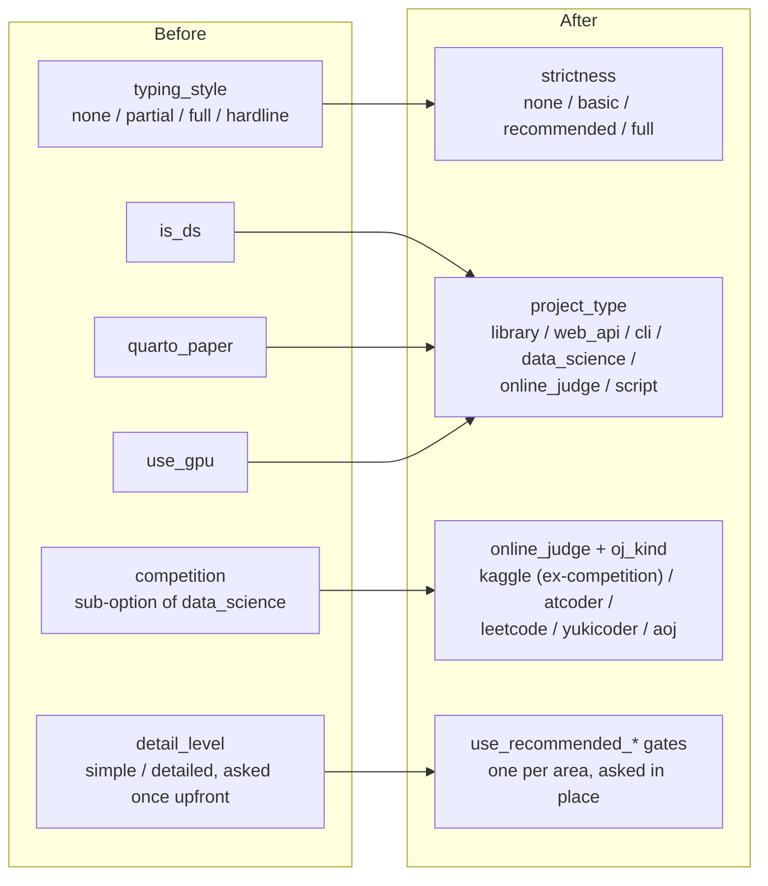

[](https://github.com/kasi-x/python-copier-template/actions/workflows/ci.yml)
[](https://www.apache.org/licenses/LICENSE-2.0)
[](https://scorecard.dev/viewer/?uri=github.com/kasi-x/python-copier-template)
[](https://github.com/astral-sh/ruff)

# python-copier-template

An opinionated [copier](https://copier.readthedocs.io) template for Python
projects. It can be optionally used to:

- Create new projects from
- Update existing projects in line with it
- Keep projects in sync with changes to it
- Provide a source of inspiration to cherry-pick from

Source          | <https://github.com/kasi-x/python-copier-template>
:---:           | :---:
Documentation   | <https://kasi-x.github.io/python-copier-template>
Releases        | <https://github.com/kasi-x/python-copier-template/releases>

## Why this template

One copier template covering every shape of Python project — library, web
API, CLI, data pipeline, competitive programming, robotics, firmware — with
a questionnaire whose own logic is machine-verified (Z3 satisfiability over
every question path) rather than just documented. See
[Vision & Positioning](docs/explanations/vision.md) for the full comparison
with [DiamondLightSource/python-copier-template](https://github.com/DiamondLightSource/python-copier-template)
(the upstream this started from), [pawamoy/copier-uv](https://github.com/pawamoy/copier-uv),
[scientific-python/cookie](https://github.com/scientific-python/cookie) and
[cjolowicz/cookiecutter-hypermodern-python](https://github.com/cjolowicz/cookiecutter-hypermodern-python),
plus the list of what this template deliberately does *not* try to be.

## Features

The template asks a few questions and generates a project tailored to your answers.

**Recommended settings, per area.** Besides the essentials (project type,
package name, author, ...), each customisable area asks a single "use the
recommended settings?" question first (default: yes), with the recommendation
spelled out in its help text. Answer **yes** and that area is configured from
its recommended defaults without asking anything else; answer **no** and the
detailed question(s) for that area are asked — [the questionnaire
reference](docs/reference/questionnaire.md) lists every one.

<!-- BEGIN GENERATED: features-areas (tools/gen_docs.py --write) -->
| Area gate | Recommended default | Asked when |
|---|---|---|
| `use_recommended_agent` | yes — a plain library / CLI without agent tooling. | library / cli |
| `use_recommended_toolchain` | uv (package manager) + just (task runner). | not ros2 + pixi |
| `use_recommended_data_science` | GPU workloads enabled (NVIDIA CUDA Dockerfile + devcontainer). | the data_science layer is present |
| `use_recommended_polish` | src/ layout (library/cli), no Japanese (multibyte) characters in comments/docstrings. | all |
| `use_recommended_docs` | zensical (Zensical, an MkDocs fork with mkdocstrings). | all |
| `use_recommended_quality` | basedpyright (primary) + pyrefly (additional static analysis), strictness "recommended" (ruff ALL rules, typos/vulture/deptry/pip-audit). | all |
| `use_recommended_license` | MIT license, no FAIR research-software metadata (CITATION.cff / REUSE). | all |
| `use_recommended_integrations` | no Docker container, no PyPI auto-publish, no cloud provider, no Sentry, no MCP support, GitHub Actions for CI, structlog for logging. | all |
| `use_recommended_web_api` | a FastAPI app in a top-level `app/` package (no library <pkg>): async SQLAlchemy 2.0 + Alembic + Postgres, a demo CRUD router, request-id logging (asgi-correlation-id), a BackgroundTasks example, and /health + /docs endpoints. | the web_api layer is present |
| `use_recommended_security` | minimal CI permissions, GitHub Actions pinned to commit SHAs (renovate keeps them up to date), zizmor + actionlint checks, a SECURITY.md vulnerability-reporting policy, a test_qa.py that verifies dependency integrity and the public API at runtime, and a license-check task (pip-licenses --fail-on with the project's copyleft policy) that runs inside type-check. | all |
<!-- END GENERATED: features-areas -->

The branches below follow the order the questions are actually asked in
(`copier.yml`); each gate's Yes/No branches rejoin before the next gate:

```mermaid
flowchart TD
    Start([Start]) --> PT[project_type]
    PT -->|ros2| Q0["ask: pkg_language (python / cpp), ros_distro (humble / jazzy),<br/>ros2_package_manager (apt / pixi)"]
    PT -->|micropython| Q1["ask: micropython_port (esp32 / esp8266 / rp2 / stm32 / samd / unix /<br/>windows / mimxrt)"]
    PT -->|library / cli| G_agent{"use_recommended_agent?<br/>(library / cli)"}
    PT -->|other| G_toolchain{"use_recommended_toolchain?<br/>(not ros2 + pixi)"}
    Q0 --> G_toolchain
    Q1 --> G_toolchain
    G_agent -->|Yes| G_agent_yes["a plain library / CLI without agent tooling."]
    G_agent -->|No| G_agent_no["add a runnable pydantic-ai example: a prompts/ directory, a typed tools/ package…"]
    G_agent_yes --> G_toolchain
    G_agent_no --> G_toolchain
    G_toolchain -->|Yes| G_toolchain_yes["uv (package manager) + just (task runner)."]
    G_toolchain -->|No| G_toolchain_no["ask: package_manager, task_runner, task_runner_pixi"]
    G_toolchain_yes --> D2
    G_toolchain_no --> D2
    D2{"online_judge?"}
    D2 -->|Yes| Q6["ask: oj_category (data_science / competitive_coding / ctf), oj_kind<br/>(kaggle / atcoder / leetcode / yukicoder / aoj / ctf),<br/>oj_allow_ai (atcoder / leetcode)"]
    Q6 --> INC
    D2 -->|No| INC
    INC["ask: include_data_science, include_web_api, include_ctf,<br/>include_scraping<br/>(each only for the bases it combines with)"]
    INC --> L3{"include_scraping?"}
    L3 -->|Yes| G_scraping{"use_recommended_scraping?<br/>(a cli base answers Yes to include_scraping)"}
    L3 -->|No| L4
    G_scraping -->|Yes| G_scraping_yes["httpx — a polite stdlib-robots fetcher"]
    G_scraping -->|No| G_scraping_no["ask: scraping_engine"]
    G_scraping_yes --> L4
    G_scraping_no --> L4
    L4{"data science layer?"}
    L4 -->|Yes| G_data_science{"use_recommended_data_science?<br/>(the data_science layer is present)"}
    L4 -->|No| G_polish
    G_data_science -->|Yes| G_data_science_yes["GPU workloads enabled (NVIDIA CUDA Dockerfile + devcontainer)."]
    G_data_science -->|No| G_data_science_no["ask: use_gpu"]
    G_data_science_yes --> G_polish
    G_data_science_no --> G_polish
    G_polish{"use_recommended_polish?"}
    G_polish -->|Yes| G_polish_yes["src/ layout (library/cli), no Japanese"]
    G_polish -->|No| G_polish_no["ask: layout, allow_japanese"]
    G_polish_yes --> G_docs
    G_polish_no --> G_docs
    G_docs{"use_recommended_docs?"}
    G_docs -->|Yes| G_docs_yes["zensical (Zensical, an MkDocs fork with mkdocstrings)."]
    G_docs -->|No| G_docs_no["ask: docs_type"]
    G_docs_yes --> G_quality
    G_docs_no --> G_quality
    G_quality{"use_recommended_quality?"}
    G_quality -->|Yes| G_quality_yes["basedpyright (primary) + pyrefly"]
    G_quality -->|No| G_quality_no["ask: type_checker, strictness"]
    G_quality_yes --> G_license
    G_quality_no --> G_license
    G_license{"use_recommended_license?"}
    G_license -->|Yes| G_license_yes["MIT license, no FAIR research-software metadata (CITATION.cff / REUSE)."]
    G_license -->|No| G_license_no["ask: license, fair, author_orcid"]
    G_license_yes --> G_integrations
    G_license_no --> G_integrations
    G_integrations{"use_recommended_integrations?"}
    G_integrations -->|Yes| G_integrations_yes["no Docker container, no PyPI auto-publish, no cloud provider, no Sentry, no MCP…"]
    G_integrations -->|No| G_integrations_no["ask: docker, pypi, cloud_provider, aws_services, include_sentry,<br/>include_mcp, ci_provider, log_library"]
    G_integrations_yes --> L5
    G_integrations_no --> L5
    L5{"web api layer?"}
    L5 -->|Yes| G_web_api{"use_recommended_web_api?<br/>(the web_api layer is present)"}
    L5 -->|No| G_security
    G_web_api -->|Yes| G_web_api_yes["a FastAPI app in a top-level app/ package"]
    G_web_api -->|No| G_web_api_no["ask: prometheus, rate_limit, cors"]
    G_web_api_yes --> G_security
    G_web_api_no --> G_security
    G_security{"use_recommended_security?"}
    G_security -->|Yes| G_security_yes["minimal CI permissions, GitHub Actions pinned to commit SHAs"]
    G_security -->|No| G_security_no["ask: license_check, security_policy, scorecard"]
    G_security_yes --> PD
    G_security_no --> PD
    PD["Project details: package_name, description, git_platform, github_org,<br/>gitlab_group, repo_name, distribution_name, author_name,<br/>author_email"]
    PD --> End([Generate project])
```

<!-- BEGIN GENERATED: features-mermaid (tools/gen_docs.py --write) -->

<!-- END GENERATED: features-mermaid -->

**Package management** (`package_manager`)
- **uv** — fast, pure Python package manager (default)
- **pixi** — conda-based package manager with cross-language support
- **poetry** — dependency management and packaging with Poetry

**Task runner** (`task_runner`, and `task_runner_pixi` when package_manager is pixi)
- **just** — [Just](https://just.systems) justfile (default with uv/poetry)
- **task** — [Task](https://taskfile.dev) Taskfile
- **poe** — [poethepoet](https://github.com/nat-n/poethepoet) tasks in `pyproject.toml`
- **make** — GNU Make
- **pixi** — pixi's native tasks (default with pixi; poethepoet is not offered there)
- One shared task definition (`_tasks.jinja`) drives local dev *and* CI:
  the generated CI invokes the same tasks via a `_tasks.yml` reusable workflow

**Project type** (`project_type`)
- **library** — a Python library/package
- **web_api** — a working FastAPI scaffold in a top-level `app/` package
  (no library `<pkg>`; run with `uvicorn app.main:app`): async SQLAlchemy
  2.0 + Alembic + Postgres, demo CRUD router, request-id logging,
  `/health` + `/docs`. Deliberately API-only — full-stack needs point to the
  upstream full-stack-fastapi-template. Ships `compose.local.yml`
  (API + Postgres) and a CI test job backed by a Postgres service container.
  Optional: Prometheus `/metrics`, slowapi rate limiting, CORS (see the
  [web-api how-to](https://kasi-x.github.io/python-copier-template/main/how-to/web-api.html))
- **cli** — a command-line tool
- **data_science**: `data/`, `models/`, `reports/`, `notebooks/` and a `src/`
  pipeline (`src/data`, `src/features`, ...) layout. GPU Dockerfile and a
  Quarto paper are always included. Ships polars / duckdb / pyarrow as base
  deps and a `data/queries/` SQL workspace readable via
  `duckdb.sql(open("data/queries/example.sql").read())`.
- **online_judge**: a competitive-programming / Kaggle project. The follow-up
  `oj_kind` question picks the judge:
  - **kaggle**: the competition layout `src/{configs,data,input,output,features,logs,models,notebook,scripts,utils}` where `src/utils` is the installable package, plus the GPU Dockerfile
  - **atcoder / leetcode / yukicoder / aoj**: a bare code-submission workspace
    (stdlib only) — no package or `solutions/` tree is generated, and the
    repo stays empty until a CLI tool creates the per-problem folders and
    `test/` sample files (`oj` for AtCoder / yukicoder, `acc` for AtCoder
    contests, `aoj-cli` for AOJ; LeetCode is solved in its own editor)
- **script** — a minimal script, flat package at the repo root
- **ros2** — a ROS 2 package (`ament_python` with rclpy, or `ament_cmake`
  with C++), built with **colcon + rosdep**. Choose **Humble** (Ubuntu
  22.04 / Python 3.10, recommended for its wide deployment) or **Jazzy**
  (Ubuntu 24.04 / Python 3.12), and provision the environment with **apt**
  (classic `ros-<distro>-*` + industrial_ci) or **pixi** (RoboStack
  conda-forge via `https://prefix.dev/robostack-<distro>`). Generates
  `package.xml`, `setup.py`/`CMakeLists.txt`, `resource/`, ament linter
  tests, `Dockerfile.ros2`, and a ROS-aware devcontainer. CI runs
  industrial_ci (apt) or setup-pixi + colcon (pixi). See the
  [ros2 how-to](https://kasi-x.github.io/python-copier-template/main/how-to/ros2.html)
- **micropython** — MicroPython firmware for a microcontroller (ESP32 / RP2 /
  STM32 / ...). Choose the target **port** (`micropython_port`); the firmware
  lives in `firmware/` (`boot.py`, `main.py`, `board_config.py` + a
  device-independent `core/`), is deployed with **mpremote**, and is
  type-checked against `micropython-<port>-stubs` (installed into a git-ignored
  `typings/` folder). The CPython dev toolchain (uv/ruff/pytest/basedpyright)
  coexists to unit-test `core/`. See the
  [MicroPython how-to](https://kasi-x.github.io/python-copier-template/main/how-to/micropython.html)

**Combining bases and layers** (`include_data_science`, `include_web_api`)
- `project_type` picks the **base**; two opt-in questions can layer another
  element on top: `include_data_science` (asked for `library` / `cli` /
  `web_api`) adds the analysis layout (`notebooks/`, `data/`, `models/`,
  `reports/`, Quarto paper), and `include_web_api` (asked for `library` /
  `cli` / `data_science` and Kaggle) adds the FastAPI scaffold (top-level
  `app/`). So a data_science base can ship an API, and an API base can ship
  analysis directories and MCP — in one repo.
- `ros2` / `micropython` / code-submission judges / `script` stay
  single-type: their build or execution shape cannot be combined.

**Layout** (`layout`, for `library` / `cli`)
- **src** — package in a `src/` directory (**default**; prevents accidental
  imports of an uninstalled package)
- **flat** — package at the repository root
- `data_science` always uses `src/`; `online_judge` with the `kaggle` kind
  uses `src/` too (as `src/utils`); `script` always uses flat; `web_api`
  always uses a top-level `app/` package (no `src`/flat question);
  `micropython` and `ros2` don't ask (firmware/ament layouts instead)

**AI agent** (`use_recommended_agent`, for `library` / `cli`)
- Recommended: **no** — a plain library / CLI without agent tooling.
- Answer **no** to scaffold a runnable [pydantic-ai](https://ai.pydantic.dev)
  example: a `prompts/agent.md` system prompt, a typed `tools/` package
  (`tools/example.py`) and a module-level `agent` wired with `@agent.tool`.
  `python -m <package>.agent "..."` runs offline via pydantic-ai's
  `TestModel`; pass `--model openai:gpt-4o-mini` (with the matching API key in
  the environment) for a real model.

**Cloud / integrations**
- **Cloud provider** (`cloud_provider`): `none` (default) / `aws` (boto3 +
  service type stubs) / `gcp` (google-cloud-storage) / `azure`
  (azure-identity). For `aws`, `aws_services` picks the `boto3-stubs` extra
  (`essential` / `s3` / `dynamodb` / `sqs` / `lambda`).
- **Sentry** (`include_sentry`): adds `sentry-sdk` and initialises it from
  `SENTRY_DSN` at CLI startup.
- **MCP** (`include_mcp`, cli / web_api / the API layer): adds the `mcp[cli]`
  SDK and scaffolds an `mcp_server.py` with typed example tools, a `ToolError`
  sample and a resource, plus a `mcp-server-<name>` console script and an
  in-process client test — the template's first *long-running executable*
  layer (see
  [the layer model](https://kasi-x.github.io/python-copier-template/main/explanations/long-running.html)
  and the
  [MCP how-to](https://kasi-x.github.io/python-copier-template/main/how-to/mcp.html)).
  The module lives in `app/mcp_server.py` when the web_api layer is present,
  otherwise in `<pkg>/mcp_server.py`.
  Run it with stdio (an MCP host launches `uv run mcp-server-<name>`) or
  streamable-http (`--transport streamable-http`), and debug it with the
  MCP Inspector (`uv run mcp dev src/<package>/mcp_server.py`).
- **Logging library** (`log_library`): `structlog` (default) / `loguru` /
  `picologging` / `logging` (standard library, no extra dependency).
  `logging_setup.py` exposes the same `logger.bind(...)` / `logger.info(event,
  **fields)` call shape regardless of which one is chosen, plus a
  `LOG_FORMAT=json` console/JSON switch. Not asked for `ros2` packages (they
  use rclpy's own node logger) or `micropython` firmware (logging runs on the
  device, not through CPython's logging stack).

**Experimentation** (`[project.optional-dependencies] experiment` / pixi `experiment` feature)
- marimo notebooks, matplotlib / seaborn / plotly for debugging, plus LLM API deps
- Kept separate from the minimal runtime dependencies

**License & changelog**
- **License** (`license`, asked when you opt out of `use_recommended_license`
  — the recommendation is MIT): the full
  [choosealicense.com](https://choosealicense.com) list (MIT, Apache-2.0,
  GPL/LGPL/AGPL, BSD variants, MPL-2.0, ISC, Unlicense, CC0, and more), plus a
  `Proprietary` / all-rights-reserved option. Sets the `LICENSE` file text,
  `pyproject.toml`'s PEP 639 `license`/`license-files`, and the README badge.
  Regenerated from source via `tools/generate_license_template.py`.
- **Changelog**: [git-cliff](https://git-cliff.org) generates `CHANGELOG.md`
  from [Conventional Commits](https://www.conventionalcommits.org); commit
  messages are enforced in CI (a conventional-commits check in the hygiene
  workflow), and each GitHub Release's notes are generated by git-cliff from
  that tag's commits.
- **FAIR / research-software metadata** (adapted from
  [fair-python-cookiecutter](https://github.com/Materials-Data-Science-and-Informatics/fair-python-cookiecutter)):
  the `fair` option adds a `CITATION.cff` (validated in CI, optional
  `author_orcid`); CI additionally covers `REUSE.toml`
  with SPDX annotations — only for open-source licenses, Proprietary
  projects skip it. It also adds a `fair-software.yml` GitHub Actions
  workflow running
  [howfairis](https://github.com/fair-software/howfairis-github-action) to
  measure compliance with the [fair-software.eu](https://fair-software.eu)
  recommendations on push to `main`.
- **Data governance** (`data_science` projects; independent
  of `fair`): a one-page de-identification protocol (ISO/IEC 20889), a
  data-transfer-agreement template and a transfer log always ship in
  `data/`, so every non-public extract that leaves for another organisation
  can be traced back to an agreement and an approver. On top of that,
  `data_reusable` opts into a **DUO** (Data Use Ontology) data-use
  conditions sheet, and `data_ethics` opts into a **CARE** principles
  data-governance statement (with provenance & custody records) — both
  asked under the data-science gate.

**Tooling**
- [setuptools](https://setuptools.pypa.io) + [setuptools-scm](https://setuptools-scm.readthedocs.io) packaging
- [pytest](https://docs.pytest.org), coverage, hypothesis
- [ruff](https://docs.astral.sh/ruff), [vulture](https://github.com/jendrikseipp/vulture),
  [deptry](https://deptry.com), [typos](https://github.com/crate-ci/typos)
- [basedpyright](https://docs.basedpyright.com) plus [pyrefly](https://github.com/facebook/pyrefly) or [ty](https://docs.astral.sh/ty/) as the secondary checker
- CI-enforced repo hygiene (secret scanning via gitleaks, actionlint,
  YAML/EOF checks, conventional commits) in a dedicated workflow
- [OpenSSF Scorecard](https://securityscorecards.dev) workflow + a
  [SECURITY.md](SECURITY.md) vulnerability-reporting policy
- [editorconfig](https://editorconfig.org) (`.editorconfig`) for consistent
  editor indentation and line endings
- A `.env.example` with the environment variables the project understands
  (`.env` is git-ignored and auto-loaded by direnv / the compose stack)
- Author/GitHub-org questions have plain defaults (override at any prompt)
<!-- BEGIN GENERATED: features-task-runner (tools/gen_docs.py --write) -->
- A task runner of your choice ([Just](https://just.systems) (default) /
  [Task&nbsp;(go-task)](https://taskfile.dev) / [poethepoet](https://github.com/nat-n/poethepoet) /
  [Make](https://www.gnu.org/software/make/) / [pyinvoke](https://www.pyinvoke.org) /
  [duty](https://duty.readthedocs.io)) driving lint / type-check / test / docs — one shared task
  definition, invoked by CI too. With `package_manager` = pixi, the choices are
  [pixi&nbsp;(native&nbsp;tasks)](https://pixi.sh) (default) /
  [Task&nbsp;(go-task)](https://taskfile.dev) / [Just](https://just.systems) /
  [Make](https://www.gnu.org/software/make/) (poethepoet is not offered there).
<!-- END GENERATED: features-task-runner -->
- [zensical](https://zens.python.dev), [sphinx](https://www.sphinx-doc.org) or
  [great-docs](https://posit-dev.github.io/great-docs/) for docs
- README badge row: CI, coverage, license, a Python-version badge matching
  the actual CI test matrix, and each tool's own *officially documented*
  badge — [Ruff](https://github.com/astral-sh/ruff) and a
  ["Made with Copier"](https://github.com/copier-org/copier#show-your-support)
  badge (h/t [reproML](https://github.com/Excidion/reproML) and
  [pypackage-template](https://github.com/browniebroke/pypackage-template)).
  No unofficial/inferred tool badges (e.g. uv, pixi have none) —
  [pawamoy/copier-uv](https://github.com/pawamoy/copier-uv), a well-known
  uv-based copier template, only badges CI/docs/chat for the same reason.

**CI/CD**
- **CI provider** (`ci_provider`): `github_actions` (default) generates the
  full GitHub Actions workflow set; `none` skips `.github/workflows/`
- GitHub Actions: `concurrency` with `cancel-in-progress`, minimal
  `permissions`, and a `required-checks-passed` gate for branch protection
- **Security gate** (`use_recommended_security`, default yes): GitHub Actions
  pinned to commit SHAs via renovate (`helpers:pinGitHubActionDigests`), a
  zizmor CI job auditing the workflows, a generated `tests/test_qa.py`, and —
  when you opt out (GitHub projects) — the choice of a `SECURITY.md`
  vulnerability policy and an OpenSSF Scorecard workflow (public repos only).
  GitLab projects keep the hardened `.gitlab-ci.yml` but skip the GitHub-only
  files (SECURITY.md / Scorecard)
- PyPI publishing, Docker containers, docs deployment to GitHub Pages

## Design decisions

The option set has been consolidated over time. The key moves:

- **`typing_style` → `strictness`**: type-annotation strictness and the
  static-analysis toolchain are now one axis (`none` / `basic` /
  `recommended` / `full`) instead of two loosely-coupled ones. `recommended`
  (the default) is the full toolchain used by the author's
  [`~/dotfiles/template`](https://github.com/kasi-x/dotfiles): ruff with
  `ALL` rules, basedpyright + pyrefly, typos / vulture / deptry / pip-audit.
- **`is_ds` / `quarto_paper` / `use_gpu` → `project_type`**: project kind is
  now one axis (`library` / `web_api` / `cli` / `data_science` / `online_judge`
  / `script`). The GPU Dockerfile and Quarto paper are always part of
  `data_science` rather than separate toggles.
- **`competition` (sub-option of data_science) → `online_judge` +
  `oj_kind=kaggle`**: a Kaggle-style competition is a *competition*, not an
  analysis project — the AI-use rules and the GPU/submission layout differ
  from plain data science. It now lives under the `online_judge` project
  type, so `data_science` is purely the analysis layout and
  `online_judge` can also express code-submission judges (AtCoder / LeetCode
  / yukicoder / AOJ — a bare workspace the user drives with `oj` / `acc` /
  `aoj-cli`).
- **`detail_level` → one "use recommended settings?" gate per area**: a
  single upfront simple/detailed toggle controlled ~20 questions at once, so
  going off the beaten path for one option (say, the license) meant opting
  into every other detailed question too. Each customisable area now asks
  its own yes/no gate, right where that area comes up, with the
  recommendation spelled out in its help text — see the previous section.
- **Long-running executables (bots, MCP servers) are a layer, not a
  `project_type`**: they run on the same CPython + uv environment as
  `library` / `cli` / `web_api`, so adding a `daemon` type would violate the
  "project_type = fundamentally different execution environment" rule.
  Instead they are opt-in modules with their own entry point (the first
  instance is `include_mcp` → `mcp_server.py` on `cli` / `web_api`, with a
  `mcp-server-<name>` console script), started by an MCP host or via
  `python -m <package>.mcp_server` — never through `__main__.py`, which the
  Docker `ENTRYPOINT` and CLI tests own. The same base+layer idea now covers
  `include_data_science` / `include_web_api`: one generated repo can hold a
  base plus another element (data_science + web_api, web_api + MCP, ...). See
  [the layer model](https://kasi-x.github.io/python-copier-template/main/explanations/long-running.html).
- **`web_api` is now a working FastAPI scaffold, not a shell**: it used to
  generate Docker/compose/Postgres wiring and tell you to "add fastapi +
  uvicorn yourself". It now ships the full recommended stack — async
  SQLAlchemy 2.0 + Alembic + Postgres, a demo CRUD router, request-id logging
  (asgi-correlation-id), `BackgroundTasks`, and `/health` + `/docs` — with
  tests that run against SQLite locally and Postgres in CI. The web-API
  detail gate (`use_recommended_web_api`) offers exactly three switches
  (Prometheus /metrics via prometheus-client, slowapi rate limiting, CORS),
  deliberately not a catalogue; auth, other ORMs, admin UIs and task queues
  are documented as "add later" (fastapi-users is in maintenance mode, which
  is why no auth is baked in).



## Example

You can see the template in action in the
[example project](https://github.com/kasi-x/python-copier-template-example).

## Create a new project

We recommend invoking copier via `uvx`. Without `--vcs-ref` copier expands the
repository's **newest release tag**, which since the 6.0.0 fork detach is this
fork's own release — so the command below generates from the current template
and no flag is needed. Add `--vcs-ref=6.0.0` only to pin an exact release and
make the generation reproducible:

```
git init --initial-branch=main /path/to/my-project
# $_ resolves to /path/to/my-project
uvx copier copy --trust \
    https://github.com/kasi-x/python-copier-template.git $_
```

(`--trust` is required: the template uses post-generation tasks (the
adoption report, the next-steps hint and the REUSE `LICENSES/` copy).
Without it copier refuses to generate anything and exits with status 4.)

### Non-interactive mode

For CI/CD or automated project generation, use `--data-file` with `--defaults`.
Every question has a default, so a minimal answers file plus `--defaults`
fully determines the project; anything in the file overrides that default:

```bash
# Create answers file
cat > answers.yml << 'EOF'
---
project_type: library
package_name: my_package
description: My awesome package
git_platform: github.com
github_org: my-org
EOF

# Generate project
uvx copier copy --trust --defaults \
    --data-file answers.yml /path/to/my-project
```

Notes:

- `--defaults` answers every question it would ask with its default, so it
  never prompts. A value from `--data-file` counts as answered, which also
  drives the `when` gating of the follow-up questions (e.g.
  `use_recommended_integrations: false` reveals the integration details and
  `--defaults` fills them in).
- Values supplied for a question whose `when` is false (e.g. `docs_type`
  while `use_recommended_docs` is true) are still validated against the
  choices — pass the gate answer too, or drop the unused value.
- `--answers-file` must be a path **relative to the destination directory**
  (copier requirement), e.g. `.copier-answers.yml`.

**Troubleshooting:**

- Exit status 4, nothing generated → you omitted `--trust`
- "Question X is required" → add X to your answers file (see
  `questions/*.yml` for every question and its default)
- "Invalid choice for X" → check the valid choices in `questions/*.yml`

<!-- README only content. Anything below this line won't be included in index.md -->

See https://kasi-x.github.io/python-copier-template for more detailed documentation.
