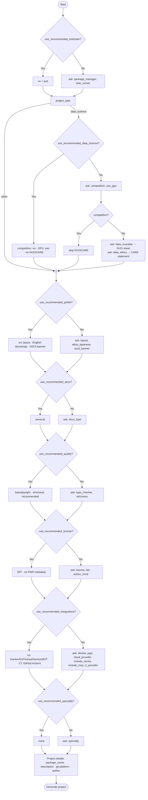
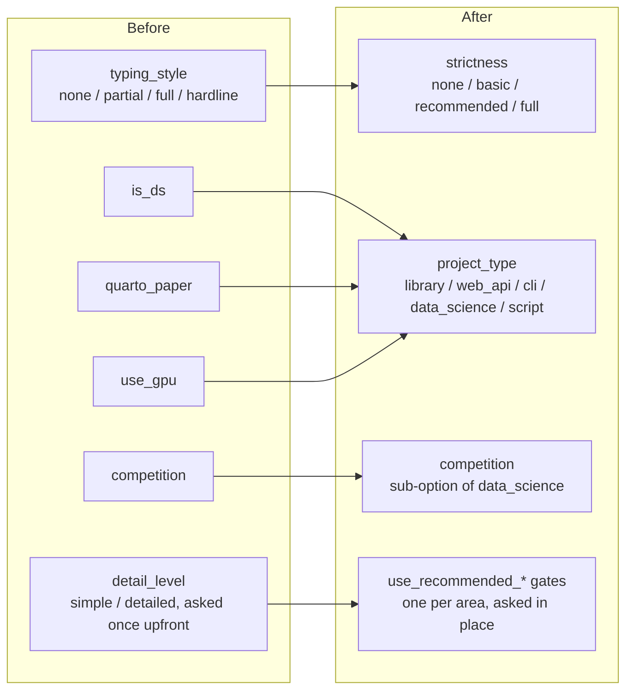

[](https://github.com/kasi-x/python-copier-template/actions/workflows/ci.yml)
[](https://www.apache.org/licenses/LICENSE-2.0)

# python-copier-template

An opinionated [copier](https://copier.readthedocs.io) template for Python
projects. It can be optionally used to:

- Create new projects from
- Update existing projects in line with it
- Keep projects in sync with changes to it
- Provide a source of inspiration to cherry-pick from

Source          | <https://github.com/kasi-x/python-copier-template>
:---:           | :---:
Documentation   | <https://kasi-x.github.io/python-copier-template>
Releases        | <https://github.com/kasi-x/python-copier-template/releases>

## Features

The template asks a few questions and generates a project tailored to your answers.

**Recommended settings, per area** (`use_recommended_toolchain`,
`use_recommended_data_science`, `use_recommended_polish`,
`use_recommended_docs`, `use_recommended_quality`, `use_recommended_license`,
`use_recommended_integrations`, `use_recommended_specialty`)
- Besides the essentials (project type, package name, author, ...), each
  customisable area of the template — toolchain, data-science options
  (competition, GPU, DUO/CARE data governance), layout & style, docs,
  type-checking & strictness, license & FAIR metadata, deployment &
  integrations, specialisation — asks a single "use the recommended
  settings?" question first (default: yes), with the recommendation spelled
  out in its help text.
- Answer **yes** and the area is configured from its defaults without
  asking anything else; answer **no** and the detailed question(s) for that
  area are asked (package manager choice, CI provider, GPU, cloud provider,
  and so on).

The branches below follow the order the questions are actually asked in
(`copier.yml`); each gate's Yes/No branches rejoin before the next gate:



**Package management** (`package_manager`)
- **uv** — fast, pure Python package manager (default)
- **pixi** — conda-based package manager with cross-language support
- **poetry** — dependency management and packaging with Poetry

**Task runner** (`task_runner`, and `task_runner_pixi` when package_manager is pixi)
- **just** — [Just](https://just.systems) justfile (default with uv/poetry)
- **task** — [Task](https://taskfile.dev) Taskfile
- **poe** — [poethepoet](https://github.com/nat-n/poethepoet) tasks in `pyproject.toml`
- **make** — GNU Make
- **pixi** — pixi's native tasks (default with pixi; poethepoet is not offered there)
- One shared task definition (`_tasks.jinja`) drives local dev *and* CI:
  the generated CI invokes the same tasks via a `_tasks.yml` reusable workflow

**Project type** (`project_type`)
- **library** — a Python library/package
- **web_api** — a web API service (Docker included)
- **cli** — a command-line tool
- **data_science**: `data/`, `models/`, `reports/`, `notebooks/` and a `src/`
  pipeline (`src/data`, `src/features`, ...) layout. GPU Dockerfile and a
  Quarto paper are always included.
  - **Competition** (Kaggle-style): `src/{configs,data,input,output,features,logs,models,notebook,scripts,utils}` where `src/utils` is the installable package
- **script** — a minimal script, flat package at the repo root

**Layout** (`layout`, for `library` / `web_api` / `cli`)
- **src** — package in a `src/` directory (**default**; prevents accidental
  imports of an uninstalled package)
- **flat** — package at the repository root
- `data_science` always uses `src/`; `script` always uses flat

**Specialisation** (`specialty`)
- **none** — no specialisation (default)
- **mcp_server** — MCP server scaffold (`mcp_server.py`, inspector script)
- **ai_agent** — LLM agent / RAG app (`tools/` folder, `prompts/`, pydantic-ai)
- **data_polars** — Polars + DuckDB pipeline (`queries/`, polars/duckdb/pyarrow)
- **rust_extension** — PyO3 / maturin extension (`rust/Cargo.toml` + `lib.rs`)
- **pure_python_web** — FastHTML app (`app/app.py` with hot reload)

**Cloud / integrations**
- **Cloud provider** (`cloud_provider`): `none` (default) / `aws` (boto3 +
  service type stubs) / `gcp` (google-cloud-storage) / `azure`
  (azure-identity). For `aws`, `aws_services` picks the `boto3-stubs` extra
  (`essential` / `s3` / `dynamodb` / `sqs` / `lambda`).
- **Sentry** (`include_sentry`): adds `sentry-sdk` and initialises it from
  `SENTRY_DSN` at CLI startup.
- **MCP** (`include_mcp`): adds the `mcp` SDK and scaffolds an
  `mcp_server.py` with stdio and SSE transports.

**Experimentation** (`[project.optional-dependencies] experiment` / pixi `experiment` feature)
- marimo notebooks, matplotlib / seaborn / plotly for debugging, plus LLM API deps
- Kept separate from the minimal runtime dependencies

**License & changelog**
- **License** (`license`, asked when you opt out of `use_recommended_license`
  — the recommendation is MIT): the full
  [choosealicense.com](https://choosealicense.com) list (MIT, Apache-2.0,
  GPL/LGPL/AGPL, BSD variants, MPL-2.0, ISC, Unlicense, CC0, and more), plus a
  `Proprietary` / all-rights-reserved option. Sets the `LICENSE` file text,
  `pyproject.toml`'s PEP 639 `license`/`license-files`, and the README badge.
  Regenerated from source via `tools/generate_license_template.py`.
- **Changelog**: [git-cliff](https://git-cliff.org) generates `CHANGELOG.md`
  from [Conventional Commits](https://www.conventionalcommits.org); commit
  messages are enforced by a `conventional-pre-commit` hook, and each
  GitHub Release's notes are generated by git-cliff from that tag's commits.
- **FAIR / research-software metadata** (adapted from
  [fair-python-cookiecutter](https://github.com/Materials-Data-Science-and-Informatics/fair-python-cookiecutter)):
  the `fair` option adds a `CITATION.cff` (validated by a pre-commit hook,
  optional `author_orcid`); the `reuse` hook additionally covers `REUSE.toml`
  with SPDX annotations — only for open-source licenses, Proprietary
  projects skip it. It also adds a `fair-software.yml` GitHub Actions
  workflow running
  [howfairis](https://github.com/fair-software/howfairis-github-action) to
  measure compliance with the [fair-software.eu](https://fair-software.eu)
  recommendations on push to `main`.
- **Data governance** (non-competition `data_science` projects; independent
  of `fair`): a one-page de-identification protocol (ISO/IEC 20889), a
  data-transfer-agreement template and a transfer log always ship in
  `data/`, so every non-public extract that leaves for another organisation
  can be traced back to an agreement and an approver. On top of that,
  `data_reusable` opts into a **DUO** (Data Use Ontology) data-use
  conditions sheet, and `data_ethics` opts into a **CARE** principles
  data-governance statement (with provenance & custody records) — both
  asked right after the competition question.

**Tooling**
- [setuptools](https://setuptools.pypa.io) + [setuptools-scm](https://setuptools-scm.readthedocs.io) packaging
- [pytest](https://docs.pytest.org), coverage, hypothesis
- [ruff](https://docs.astral.sh/ruff), [vulture](https://github.com/jendrikseipp/vulture),
  [deptry](https://deptry.com), [typos](https://github.com/crate-ci/typos)
- [basedpyright](https://docs.basedpyright.com) or [pyrefly](https://github.com/facebook/pyrefly)
- [pre-commit](https://pre-commit.com) with actionlint + zizmor for CI linting
- Author/GitHub-org questions default from local `git config`/`gh` (via a
  `copier-template-extensions`-loaded `extensions.py`); override at any prompt
- A task runner of your choice ([Task](https://taskfile.dev) (default) /
  [just](https://just.systems) / [poethepoet](https://github.com/nat-n/poethepoet) /
  [Make](https://www.gnu.org/software/make/), or pixi's native tasks) driving
  lint / type-check / test / docs — one shared task definition, invoked by CI too
- [zensical](https://zens.python.dev), [sphinx](https://www.sphinx-doc.org) or
  [great-docs](https://posit-dev.github.io/great-docs/) for docs
- An ASCII-art README banner generated at copy time via a bundled MIT-licensed
  copy of [pyfiglet](https://github.com/pwaller/pyfiglet) (see `tools/` and `NOTICE`)

**CI/CD**
- **CI provider** (`ci_provider`): `github_actions` (default) generates the
  full GitHub Actions workflow set; `none` skips `.github/workflows/`
- GitHub Actions: `concurrency` with `cancel-in-progress`, minimal
  `permissions`, and a `required-checks-passed` gate for branch protection
- PyPI publishing, Docker containers, docs deployment to GitHub Pages

## Design decisions

The option set has been consolidated over time. The key moves:

- **`typing_style` → `strictness`**: type-annotation strictness and the
  static-analysis toolchain are now one axis (`none` / `basic` /
  `recommended` / `full`) instead of two loosely-coupled ones. `recommended`
  (the default) is the full toolchain used by the author's
  [`~/dotfiles/template`](https://github.com/kasi-x/dotfiles): ruff with
  `ALL` rules, basedpyright + pyrefly, typos / vulture / deptry / pip-audit.
- **`is_ds` / `quarto_paper` / `use_gpu` → `project_type`**: project kind is
  now one axis (`library` / `web_api` / `cli` / `data_science` / `script`).
  `competition` remains a sub-option of `data_science`; the GPU Dockerfile and
  Quarto paper are always part of `data_science` rather than separate toggles.
- **`detail_level` → one "use recommended settings?" gate per area**: a
  single upfront simple/detailed toggle controlled ~20 questions at once, so
  going off the beaten path for one option (say, the license) meant opting
  into every other detailed question too. Each customisable area now asks
  its own yes/no gate, right where that area comes up, with the
  recommendation spelled out in its help text — see the previous section.



## Example

You can see the template in action in the
[example project](https://github.com/kasi-x/python-copier-template-example).

## Create a new project

We recommend invoking copier via `uvx`:

```
git init --initial-branch=main /path/to/my-project
# $_ resolves to /path/to/my-project
uvx copier copy --trust https://github.com/kasi-x/python-copier-template.git $_
```

(`--trust` is required because the template runs a small post-generation task
to render the README ASCII banner.)

<!-- README only content. Anything below this line won't be included in index.md -->

See https://kasi-x.github.io/python-copier-template for more detailed documentation.
